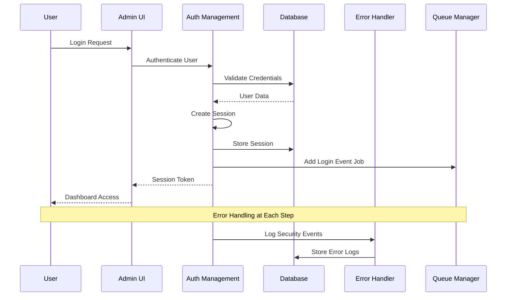
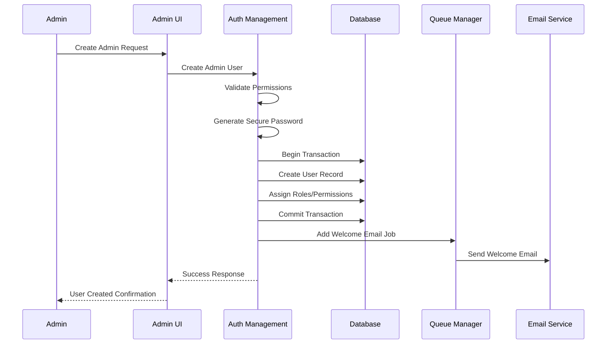
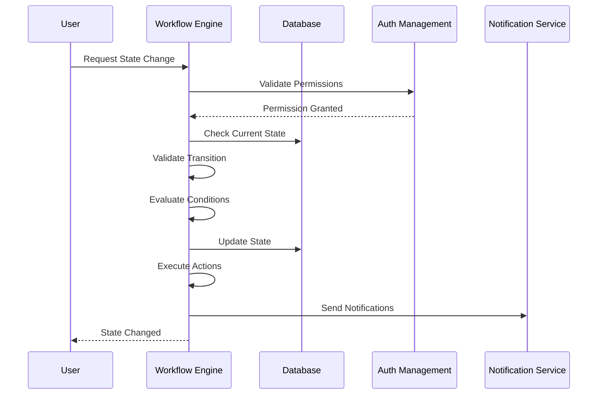

# Admin Personnel Management System Documentation

## Table of Contents
1. [System Overview](#system-overview)
2. [Architecture](#architecture)
3. [APIs and Services](#apis-and-services)
4. [Security Features](#security-features)
5. [Data Flow](#data-flow)
6. [High Availability Features](#high-availability-features)
7. [Error Handling](#error-handling)
8. [Project Workflow Management](#project-workflow-management)
9. [Queue Management](#queue-management)
10. [Connection Pooling](#connection-pooling)
11. [User Interface Features](#user-interface-features)
12. [Database Schema](#database-schema)
13. [Security Events and Monitoring](#security-events-and-monitoring)
14. [Deployment and Configuration](#deployment-and-configuration)

## System Overview

The Admin Personnel Management System is a comprehensive solution for managing administrative users with advanced security features, role-based access control, real-time monitoring, and high availability infrastructure. The system integrates authentication, authorization, error handling, workflow management, and queuing mechanisms into a unified platform.

### Key Features
- **Complete CRUD Operations** for admin user management
- **Role-Based Access Control (RBAC)** with fine-grained permissions
- **Multi-Factor Authentication** support
- **Session Management** with security tracking
- **Real-time Security Event Monitoring**
- **Database Connection Pooling** for high availability
- **Background Job Queue Management**
- **Comprehensive Error Handling and Recovery**
- **Project Workflow State Management**
- **Bulk Operations** for administrative efficiency
- **Audit Logging** for compliance and security

## Architecture

### High-Level Architecture

```
┌─────────────────────────────────────────────────────────────────┐
│                          Frontend Layer                          │
├─────────────────────────────────────────────────────────────────┤
│  Admin Personnel UI │ Security Dashboard │ System Status Monitor │
└─────────────────────────────────────────────────────────────────┘
                                │
                                ▼
┌─────────────────────────────────────────────────────────────────┐
│                        Service Layer                           │
├─────────────────────────────────────────────────────────────────┤
│ AuthManagement │ ErrorHandling │ WorkflowEngine │ QueueManager │
└─────────────────────────────────────────────────────────────────┘
                                │
                                ▼
┌─────────────────────────────────────────────────────────────────┐
│                     Infrastructure Layer                       │
├─────────────────────────────────────────────────────────────────┤
│  Connection Pool  │  Database Cluster  │  Background Workers   │
└─────────────────────────────────────────────────────────────────┘
```

### Component Architecture

#### 1. Authentication Management Service (`auth-management.ts`)
**Purpose**: Handles all authentication and authorization operations for admin users.

**Key Components**:
- User CRUD operations with security validations
- Session management and tracking
- Password security with hashing and strength validation
- Role and permission management
- Account lockout and security monitoring
- Two-factor authentication support
- Audit logging for security events

#### 2. Error Handling Service (`error-handling.ts`)
**Purpose**: Provides comprehensive error tracking, categorization, and recovery mechanisms.

**Key Components**:
- Error categorization and severity levels
- Database and file-based logging
- Pattern detection and alerting
- Automatic recovery mechanisms
- Custom error classes for different scenarios
- Integration with monitoring systems

#### 3. Project Workflow Service (`project-workflow.ts`)
**Purpose**: Manages complex project workflows with state machines, approvals, and automation.

**Key Components**:
- State machine engine with transitions
- Approval workflow management
- Event-driven automation
- Condition-based progression
- Integration with user management and error handling

#### 4. Queue Manager (`queue-manager.ts`)
**Purpose**: Handles background job processing with priority queues and retry mechanisms.

**Key Components**:
- Priority-based job queues
- Worker management and load balancing
- Dead letter queue for failed jobs
- Metrics and monitoring
- Job dependencies and scheduling

#### 5. Connection Pool Service (`connection-pool.ts`)
**Purpose**: Manages database connections for high availability and performance.

**Key Components**:
- Connection health monitoring
- Load balancing and failover
- Metrics collection and alerting
- Automatic connection recovery
- Resource management and cleanup

## APIs and Services

### Authentication Management API

#### User Management Operations

##### Create Admin User
```typescript
static async createAdminUser(
  userData: Partial<User>,
  createdBy: string,
  password?: string,
  sendWelcomeEmail: boolean = true
): Promise<User>
```

**Features**:
- Secure password generation if not provided
- Email validation and welcome email sending
- Role assignment with permission validation
- Audit logging for creation events
- Transaction-based atomic operations

**Security Measures**:
- Password strength validation
- Unique email enforcement
- Permission-based creation authorization
- Secure password hashing (bcrypt with salt)

##### Update Admin User
```typescript
static async updateAdminUser(
  userId: string,
  updateData: Partial<User>,
  updatedBy: string
): Promise<User>
```

**Features**:
- Selective field updates
- Role change validation
- Permission verification
- Audit trail maintenance
- Real-time notification system

##### Delete Admin User
```typescript
static async deleteAdminUser(
  userId: string,
  deletedBy: string,
  force: boolean = false
): Promise<void>
```

**Features**:
- Soft delete with recovery option
- Force delete for permanent removal
- Dependency validation (active sessions, projects)
- Comprehensive audit logging

#### Session Management Operations

##### Create Session
```typescript
static async createSession(
  userId: string,
  ipAddress: string,
  userAgent: string,
  deviceInfo?: Record<string, any>
): Promise<Session>
```

**Features**:
- JWT token generation with expiration
- Device fingerprinting
- Geographic location tracking
- Security event logging
- Multi-device session management

##### Validate Session
```typescript
static async validateSession(
  sessionToken: string,
  ipAddress: string,
  userAgent: string
): Promise<{ user: User; session: Session }>
```

**Features**:
- Token integrity verification
- Session expiration validation
- Security anomaly detection
- Activity logging and tracking

##### Invalidate Sessions
```typescript
static async invalidateUserSessions(
  userId: string,
  invalidatedBy: string,
  reason?: string
): Promise<void>
```

**Features**:
- Single or bulk session termination
- Immediate token blacklisting
- Real-time user notification
- Security event generation

#### Role and Permission Management

##### Assign Permissions
```typescript
static async assignPermissions(
  userId: string,
  permissionIds: string[],
  assignedBy: string
): Promise<void>
```

**Features**:
- Hierarchical permission validation
- Role-based inheritance
- Audit trail for permission changes
- Real-time authorization updates

##### Check Permission
```typescript
static async checkPermission(
  userId: string,
  resource: string,
  action: string
): Promise<boolean>
```

**Features**:
- Fast permission lookup
- Cache-optimized queries
- Hierarchical permission resolution
- Context-aware authorization

### Error Handling API

#### Error Logging and Management

##### Log Error
```typescript
static async logError(errorDetails: ErrorDetails): Promise<void>
```

**Features**:
- Structured error categorization
- Severity-based routing
- Database and file logging
- Real-time alerting system
- Pattern detection and analysis

##### Error Categories
- **AUTHENTICATION**: Login, session, and access errors
- **AUTHORIZATION**: Permission and role-related errors
- **DATABASE**: Connection, query, and transaction errors
- **VALIDATION**: Input and data validation errors
- **EXTERNAL_SERVICE**: Third-party service integration errors
- **SYSTEM**: Infrastructure and configuration errors

#### Error Recovery Mechanisms

##### Database Recovery
```typescript
static async attemptDatabaseRecovery(error: DatabaseError): Promise<boolean>
```

**Features**:
- Connection pool refresh
- Read replica failover
- Transaction retry with exponential backoff
- Connection health verification

##### Network Recovery
```typescript
static async attemptNetworkRecovery(error: NetworkError): Promise<boolean>
```

**Features**:
- DNS resolution retry
- Circuit breaker pattern
- Alternative endpoint routing
- Connection timeout adjustment

### Project Workflow API

#### Workflow Management

##### Create Workflow
```typescript
static async createWorkflow(workflowData: Partial<Workflow>): Promise<Workflow>
```

**Features**:
- State machine definition
- Transition rule configuration
- Approval chain setup
- Event handler registration

##### Progress Workflow
```typescript
static async progressWorkflow(
  workflowId: string,
  fromStateId: string,
  toStateId: string,
  userId: string,
  context: Record<string, any> = {}
): Promise<void>
```

**Features**:
- Transition validation and authorization
- Condition evaluation
- Action execution
- Event logging and notification

#### Approval Management

##### Create Approval Request
```typescript
static async createApprovalRequest(
  workflowId: string,
  requesterId: string,
  approverId: string,
  approvalData: Record<string, any>
): Promise<ApprovalRequest>
```

**Features**:
- Multi-level approval chains
- Deadline and escalation management
- Delegation and substitute approval
- Notification and reminder system

### Queue Management API

#### Job Management

##### Add Job
```typescript
async addJob(
  type: string,
  data: Record<string, any>,
  options: {
    priority?: QueuePriority;
    delay?: number;
    maxRetries?: number;
    dependencies?: string[];
    tags?: string[];
  } = {}
): Promise<string>
```

**Features**:
- Priority-based scheduling
- Dependency management
- Retry configuration
- Tag-based categorization

##### Register Worker
```typescript
async registerWorker(
  name: string,
  supportedJobTypes: string[],
  concurrency: number = 1
): Promise<string>
```

**Features**:
- Dynamic worker registration
- Load balancing across workers
- Health monitoring and heartbeat
- Automatic failover and recovery

## Security Features

### Authentication Security

#### Password Security
- **Hashing**: bcrypt with configurable salt rounds
- **Strength Validation**: Minimum length, complexity requirements
- **History Tracking**: Prevent password reuse
- **Expiration Policy**: Configurable password aging

#### Multi-Factor Authentication
- **TOTP Support**: Time-based one-time passwords
- **SMS Verification**: Phone number validation
- **Email Confirmation**: Secondary email verification
- **Recovery Codes**: Backup authentication methods

#### Session Security
- **JWT Tokens**: Cryptographically signed tokens
- **Token Rotation**: Regular token refresh
- **Device Tracking**: Device fingerprinting
- **Geographic Validation**: Location-based verification

### Authorization Security

#### Role-Based Access Control
- **Hierarchical Roles**: Super Admin > Admin > Manager > Operator
- **Fine-Grained Permissions**: Resource and action-specific
- **Dynamic Authorization**: Runtime permission evaluation
- **Principle of Least Privilege**: Minimal necessary permissions

#### Permission Management
- **Resource-Based**: Organized by system resources
- **Action-Specific**: Create, Read, Update, Delete, Execute
- **Context-Aware**: Environment and condition-based
- **Temporal Constraints**: Time-based access limitations

### Security Monitoring

#### Real-Time Event Detection
- **Failed Login Attempts**: Automatic account lockout
- **Suspicious Activity**: Anomaly detection algorithms
- **Geographic Anomalies**: Unusual location access
- **Concurrent Sessions**: Multiple simultaneous logins

#### Security Alerts
- **Immediate Notifications**: Critical event alerts
- **Escalation Procedures**: Progressive alert levels
- **Incident Response**: Automated threat response
- **Compliance Reporting**: Regulatory requirement tracking

## Data Flow

### User Authentication Flow



### Admin User Creation Flow



### Error Handling Flow

```mermary
sequenceDiagram
    participant S as Service
    participant EH as Error Handler
    participant DB as Database
    participant A as Alert System
    participant R as Recovery System

    S->>EH: Error Occurred
    EH->>EH: Categorize Error
    EH->>EH: Determine Severity
    EH->>DB: Log Error
    EH->>EH: Check Pattern
    
    alt Critical Error
        EH->>A: Send Immediate Alert
        EH->>R: Attempt Recovery
    else Pattern Detected
        EH->>A: Send Pattern Alert
    end
    
    EH-->>S: Error Handled
```

### Workflow Progression Flow



## High Availability Features

### Connection Pooling

#### Pool Configuration
```typescript
interface PoolConfig {
  minConnections: 5;        // Minimum pool size
  maxConnections: 20;       // Maximum pool size
  idleTimeoutMs: 300000;    // 5-minute idle timeout
  healthCheckIntervalMs: 30000; // 30-second health checks
  maxRetries: 3;            // Retry attempts
  retryDelayMs: 1000;       // Base retry delay
  connectionTimeoutMs: 10000; // 10-second timeout
  maxErrorsBeforeEviction: 5; // Error threshold
}
```

#### Health Monitoring
- **Connection Testing**: Regular health check queries
- **Latency Monitoring**: Response time tracking
- **Error Counting**: Failed operation tracking
- **Automatic Eviction**: Unhealthy connection removal
- **Pool Balancing**: Dynamic size adjustment

### Queue Management

#### Job Processing
- **Priority Queues**: Critical, High, Normal, Low, Background
- **Worker Scaling**: Dynamic worker allocation
- **Dead Letter Queue**: Failed job isolation
- **Retry Logic**: Exponential backoff retry
- **Dependency Resolution**: Job dependency management

#### Monitoring and Metrics
- **Throughput Tracking**: Jobs processed per minute
- **Error Rate Monitoring**: Failed job percentage
- **Queue Depth**: Pending job count
- **Worker Utilization**: Active worker percentage
- **Processing Time**: Average job completion time

### Error Recovery

#### Database Recovery
- **Connection Refresh**: Pool connection renewal
- **Read Replica Failover**: Automatic replica switching
- **Transaction Retry**: Failed transaction reprocessing
- **Deadlock Resolution**: Automatic deadlock handling

#### Network Recovery
- **DNS Retry**: Name resolution retry logic
- **Circuit Breaker**: Failure isolation pattern
- **Alternative Endpoints**: Backup service routing
- **Timeout Adjustment**: Dynamic timeout scaling

## Error Handling

### Error Classification

#### Severity Levels
1. **INFO**: Informational messages
2. **LOW**: Minor issues with minimal impact
3. **MEDIUM**: Moderate issues requiring attention
4. **HIGH**: Serious issues affecting functionality
5. **CRITICAL**: System-threatening issues

#### Error Categories
1. **AUTHENTICATION**: User authentication failures
2. **AUTHORIZATION**: Permission and access errors
3. **DATABASE**: Data persistence and retrieval errors
4. **VALIDATION**: Input and data validation errors
5. **EXTERNAL_SERVICE**: Third-party integration errors
6. **NETWORK**: Connectivity and communication errors
7. **SYSTEM**: Infrastructure and configuration errors
8. **BUSINESS_RULE**: Application logic violations

### Error Logging

#### Database Logging
```sql
CREATE TABLE error_logs (
    id UUID PRIMARY KEY,
    message TEXT NOT NULL,
    category VARCHAR(50) NOT NULL,
    severity VARCHAR(20) NOT NULL,
    details JSONB,
    user_id UUID,
    session_id UUID,
    ip_address INET,
    user_agent TEXT,
    stack_trace TEXT,
    context JSONB,
    created_at TIMESTAMP DEFAULT NOW(),
    updated_at TIMESTAMP DEFAULT NOW()
);
```

#### File Logging
- **Structured Logging**: JSON format for parsing
- **Log Rotation**: Automatic file rotation
- **Compression**: Gzip compression for archives
- **Retention Policy**: Configurable retention period

### Pattern Detection

#### Anomaly Detection
- **Frequency Analysis**: Error occurrence patterns
- **Threshold Monitoring**: Error rate thresholds
- **Trend Analysis**: Error trend detection
- **Correlation Analysis**: Related error identification

#### Alert Generation
- **Real-Time Alerts**: Immediate notification system
- **Escalation Rules**: Progressive alert escalation
- **Notification Channels**: Email, SMS, Slack integration
- **Alert Aggregation**: Grouped alert delivery

## Project Workflow Management

### State Machine Engine

#### Workflow States
```typescript
interface WorkflowState {
  id: string;
  name: string;
  displayName: string;
  description: string;
  isInitial: boolean;
  isFinal: boolean;
  allowedTransitions: string[];
  requiredPermissions: string[];
  actions: WorkflowAction[];
  conditions: WorkflowCondition[];
}
```

#### State Transitions
```typescript
interface WorkflowTransition {
  id: string;
  fromStateId: string;
  toStateId: string;
  name: string;
  conditions: WorkflowCondition[];
  actions: WorkflowAction[];
  requiredPermissions: string[];
  requiresApproval: boolean;
  approvalChain?: string[];
}
```

### Approval Management

#### Approval Chains
- **Sequential Approval**: Step-by-step approval process
- **Parallel Approval**: Concurrent approver validation
- **Conditional Approval**: Condition-based routing
- **Escalation Rules**: Time-based escalation paths

#### Approval Tracking
- **Request History**: Complete approval timeline
- **Decision Rationale**: Approval/rejection reasons
- **Delegation Support**: Substitute approver assignment
- **Deadline Management**: Time-bound approvals

### Event-Driven Automation

#### Event Types
- **State Changed**: Workflow state transition
- **Approval Requested**: Approval workflow initiation
- **Approval Completed**: Approval decision finalization
- **Condition Met**: Conditional trigger activation
- **Timer Expired**: Time-based event firing

#### Action Execution
- **Email Notifications**: Stakeholder communication
- **Database Updates**: Automated data changes
- **External API Calls**: Third-party system integration
- **Custom Scripts**: Business logic execution

## Queue Management

### Job Types

#### Admin User Management Jobs
- **admin_user_created**: New user onboarding
- **admin_user_updated**: User profile synchronization
- **admin_user_deleted**: Cleanup and archival
- **password_reset**: Password reset workflow
- **account_locked**: Security response actions

#### Security Event Jobs
- **security_alert**: Threat response processing
- **audit_log**: Compliance logging
- **session_cleanup**: Expired session removal
- **suspicious_activity**: Anomaly investigation

#### System Maintenance Jobs
- **database_backup**: Automated backup creation
- **log_rotation**: Log file management
- **health_check**: System health validation
- **metrics_collection**: Performance data gathering

### Queue Processing

#### Priority Handling
1. **CRITICAL** (Priority 1): Security alerts, system failures
2. **HIGH** (Priority 2): User management, authentication
3. **NORMAL** (Priority 3): Standard operations
4. **LOW** (Priority 4): Reporting, analytics
5. **BACKGROUND** (Priority 5): Cleanup, maintenance

#### Worker Management
- **Dynamic Scaling**: Worker count adjustment
- **Load Balancing**: Job distribution across workers
- **Health Monitoring**: Worker status tracking
- **Failure Recovery**: Worker restart and job reassignment

## Connection Pooling

### Pool Management

#### Connection Lifecycle
1. **Creation**: Establish database connection
2. **Health Check**: Validate connection status
3. **Assignment**: Allocate to requesting operation
4. **Release**: Return to available pool
5. **Eviction**: Remove unhealthy connections
6. **Cleanup**: Close and dispose connections

#### Performance Optimization
- **Connection Reuse**: Minimize connection overhead
- **Load Balancing**: Distribute connections evenly
- **Latency Monitoring**: Track response times
- **Resource Management**: Optimize memory usage

### Metrics and Monitoring

#### Pool Metrics
- **Total Connections**: Current pool size
- **Active Connections**: In-use connection count
- **Idle Connections**: Available connection count
- **Pool Utilization**: Usage percentage
- **Average Latency**: Response time metrics

#### Health Indicators
- **Connection Success Rate**: Successful connections
- **Error Rate**: Failed connection percentage
- **Recovery Time**: Failure recovery duration
- **Throughput**: Operations per second

## User Interface Features

### Admin Personnel Dashboard

#### Overview Tab
- **Metrics Cards**: Key performance indicators
- **Security Alerts**: Real-time threat monitoring
- **System Health**: Infrastructure status
- **Recent Activity**: Latest security events

#### Admin Users Tab
- **User Management**: CRUD operations interface
- **Search and Filtering**: Advanced user discovery
- **Bulk Operations**: Mass action capabilities
- **Status Management**: Account state control

#### Roles & Permissions Tab
- **Role Management**: Role definition and assignment
- **Permission Matrix**: Access control visualization
- **Hierarchy Display**: Role relationship mapping
- **Assignment Interface**: Permission allocation tools

#### Security Events Tab
- **Event Timeline**: Chronological event display
- **Severity Filtering**: Event categorization
- **Detail Investigation**: Deep-dive analysis
- **Response Actions**: Threat response tools

#### System Status Tab
- **Connection Pool**: Database health monitoring
- **Queue Status**: Background job tracking
- **Performance Metrics**: System performance data
- **Alert Configuration**: Monitoring setup

#### Bulk Actions Tab
- **Multi-Selection**: Batch operation selection
- **Action Configuration**: Bulk operation setup
- **Progress Tracking**: Operation status monitoring
- **Result Reporting**: Operation outcome display

### Advanced Features

#### Real-Time Updates
- **WebSocket Integration**: Live data streaming
- **Event Broadcasting**: Real-time notifications
- **Status Synchronization**: Multi-user coordination
- **Conflict Resolution**: Concurrent operation handling

#### Security Enhancements
- **Two-Factor Authentication**: Enhanced login security
- **Session Management**: Multi-device session control
- **IP Whitelisting**: Network access restriction
- **Audit Logging**: Complete action tracking

## Database Schema

### Core Tables

#### Users Table
```sql
CREATE TABLE users (
    id UUID PRIMARY KEY DEFAULT gen_random_uuid(),
    name VARCHAR(255) NOT NULL,
    email VARCHAR(255) UNIQUE NOT NULL,
    phone VARCHAR(50),
    password_hash VARCHAR(255) NOT NULL,
    salt VARCHAR(255) NOT NULL,
    role VARCHAR(50) NOT NULL DEFAULT 'admin',
    department VARCHAR(100),
    location VARCHAR(100),
    is_active BOOLEAN DEFAULT true,
    account_locked BOOLEAN DEFAULT false,
    account_locked_reason TEXT,
    account_locked_until TIMESTAMP,
    failed_login_attempts INTEGER DEFAULT 0,
    last_login TIMESTAMP,
    last_login_ip INET,
    password_changed_at TIMESTAMP DEFAULT NOW(),
    two_factor_enabled BOOLEAN DEFAULT false,
    two_factor_secret VARCHAR(255),
    email_verified BOOLEAN DEFAULT false,
    phone_verified BOOLEAN DEFAULT false,
    avatar_url TEXT,
    metadata JSONB DEFAULT '{}',
    created_by UUID REFERENCES users(id),
    created_at TIMESTAMP DEFAULT NOW(),
    updated_at TIMESTAMP DEFAULT NOW()
);
```

#### Sessions Table
```sql
CREATE TABLE user_sessions (
    id UUID PRIMARY KEY DEFAULT gen_random_uuid(),
    user_id UUID NOT NULL REFERENCES users(id) ON DELETE CASCADE,
    session_token VARCHAR(255) UNIQUE NOT NULL,
    refresh_token VARCHAR(255) UNIQUE,
    ip_address INET NOT NULL,
    user_agent TEXT,
    device_info JSONB DEFAULT '{}',
    location_info JSONB DEFAULT '{}',
    is_active BOOLEAN DEFAULT true,
    expires_at TIMESTAMP NOT NULL,
    last_activity TIMESTAMP DEFAULT NOW(),
    created_at TIMESTAMP DEFAULT NOW()
);
```

#### Roles Table
```sql
CREATE TABLE roles (
    id UUID PRIMARY KEY DEFAULT gen_random_uuid(),
    name VARCHAR(50) UNIQUE NOT NULL,
    display_name VARCHAR(100) NOT NULL,
    description TEXT,
    level INTEGER NOT NULL DEFAULT 1,
    is_active BOOLEAN DEFAULT true,
    permissions JSONB DEFAULT '[]',
    metadata JSONB DEFAULT '{}',
    created_at TIMESTAMP DEFAULT NOW(),
    updated_at TIMESTAMP DEFAULT NOW()
);
```

#### Permissions Table
```sql
CREATE TABLE permissions (
    id UUID PRIMARY KEY DEFAULT gen_random_uuid(),
    name VARCHAR(100) UNIQUE NOT NULL,
    display_name VARCHAR(150) NOT NULL,
    description TEXT,
    resource VARCHAR(100) NOT NULL,
    action VARCHAR(50) NOT NULL,
    conditions JSONB DEFAULT '{}',
    is_active BOOLEAN DEFAULT true,
    created_at TIMESTAMP DEFAULT NOW(),
    updated_at TIMESTAMP DEFAULT NOW()
);
```

#### User Permissions Table
```sql
CREATE TABLE user_permissions (
    id UUID PRIMARY KEY DEFAULT gen_random_uuid(),
    user_id UUID NOT NULL REFERENCES users(id) ON DELETE CASCADE,
    permission_id UUID NOT NULL REFERENCES permissions(id) ON DELETE CASCADE,
    granted_by UUID REFERENCES users(id),
    granted_at TIMESTAMP DEFAULT NOW(),
    expires_at TIMESTAMP,
    conditions JSONB DEFAULT '{}',
    UNIQUE(user_id, permission_id)
);
```

### Security and Audit Tables

#### Security Events Table
```sql
CREATE TABLE security_events (
    id UUID PRIMARY KEY DEFAULT gen_random_uuid(),
    user_id UUID REFERENCES users(id),
    session_id UUID REFERENCES user_sessions(id),
    event_type VARCHAR(50) NOT NULL,
    event_subtype VARCHAR(50),
    description TEXT NOT NULL,
    severity VARCHAR(20) NOT NULL DEFAULT 'medium',
    ip_address INET,
    user_agent TEXT,
    device_info JSONB DEFAULT '{}',
    location_info JSONB DEFAULT '{}',
    details JSONB DEFAULT '{}',
    resolved BOOLEAN DEFAULT false,
    resolved_by UUID REFERENCES users(id),
    resolved_at TIMESTAMP,
    created_at TIMESTAMP DEFAULT NOW()
);
```

#### Audit Logs Table
```sql
CREATE TABLE audit_logs (
    id UUID PRIMARY KEY DEFAULT gen_random_uuid(),
    user_id UUID REFERENCES users(id),
    session_id UUID REFERENCES user_sessions(id),
    action VARCHAR(100) NOT NULL,
    resource_type VARCHAR(50) NOT NULL,
    resource_id UUID,
    old_values JSONB,
    new_values JSONB,
    ip_address INET,
    user_agent TEXT,
    success BOOLEAN DEFAULT true,
    error_message TEXT,
    metadata JSONB DEFAULT '{}',
    created_at TIMESTAMP DEFAULT NOW()
);
```

### High Availability Tables

#### Queue Jobs Table
```sql
CREATE TABLE queue_jobs (
    id UUID PRIMARY KEY DEFAULT gen_random_uuid(),
    type VARCHAR(100) NOT NULL,
    priority INTEGER NOT NULL DEFAULT 3,
    status VARCHAR(20) NOT NULL DEFAULT 'pending',
    data JSONB NOT NULL DEFAULT '{}',
    metadata JSONB NOT NULL DEFAULT '{}',
    dependencies UUID[] DEFAULT '{}',
    tags VARCHAR(50)[] DEFAULT '{}',
    scheduled_at TIMESTAMP DEFAULT NOW(),
    started_at TIMESTAMP,
    completed_at TIMESTAMP,
    worker_id VARCHAR(255),
    error_message TEXT,
    retry_count INTEGER DEFAULT 0,
    max_retries INTEGER DEFAULT 3,
    created_at TIMESTAMP DEFAULT NOW(),
    updated_at TIMESTAMP DEFAULT NOW()
);
```

#### Error Logs Table
```sql
CREATE TABLE error_logs (
    id UUID PRIMARY KEY DEFAULT gen_random_uuid(),
    message TEXT NOT NULL,
    category VARCHAR(50) NOT NULL,
    severity VARCHAR(20) NOT NULL,
    error_code VARCHAR(50),
    details JSONB DEFAULT '{}',
    user_id UUID REFERENCES users(id),
    session_id UUID REFERENCES user_sessions(id),
    ip_address INET,
    user_agent TEXT,
    stack_trace TEXT,
    context JSONB DEFAULT '{}',
    resolved BOOLEAN DEFAULT false,
    resolved_by UUID REFERENCES users(id),
    resolved_at TIMESTAMP,
    created_at TIMESTAMP DEFAULT NOW(),
    updated_at TIMESTAMP DEFAULT NOW()
);
```

### Workflow Management Tables

#### Workflows Table
```sql
CREATE TABLE workflows (
    id UUID PRIMARY KEY DEFAULT gen_random_uuid(),
    name VARCHAR(200) NOT NULL,
    description TEXT,
    version INTEGER DEFAULT 1,
    is_active BOOLEAN DEFAULT true,
    states JSONB NOT NULL DEFAULT '[]',
    transitions JSONB NOT NULL DEFAULT '[]',
    configuration JSONB DEFAULT '{}',
    created_by UUID REFERENCES users(id),
    created_at TIMESTAMP DEFAULT NOW(),
    updated_at TIMESTAMP DEFAULT NOW()
);
```

#### Workflow Instances Table
```sql
CREATE TABLE workflow_instances (
    id UUID PRIMARY KEY DEFAULT gen_random_uuid(),
    workflow_id UUID NOT NULL REFERENCES workflows(id),
    entity_type VARCHAR(100) NOT NULL,
    entity_id UUID NOT NULL,
    current_state_id VARCHAR(100) NOT NULL,
    initiated_by UUID REFERENCES users(id),
    context JSONB DEFAULT '{}',
    metadata JSONB DEFAULT '{}',
    started_at TIMESTAMP DEFAULT NOW(),
    completed_at TIMESTAMP,
    is_active BOOLEAN DEFAULT true
);
```

### Indexes and Performance

#### Essential Indexes
```sql
-- User management indexes
CREATE INDEX idx_users_email ON users(email);
CREATE INDEX idx_users_role ON users(role);
CREATE INDEX idx_users_active ON users(is_active);
CREATE INDEX idx_users_locked ON users(account_locked);

-- Session management indexes
CREATE INDEX idx_sessions_user_id ON user_sessions(user_id);
CREATE INDEX idx_sessions_token ON user_sessions(session_token);
CREATE INDEX idx_sessions_active ON user_sessions(is_active);
CREATE INDEX idx_sessions_expires ON user_sessions(expires_at);

-- Security event indexes
CREATE INDEX idx_security_events_user_id ON security_events(user_id);
CREATE INDEX idx_security_events_type ON security_events(event_type);
CREATE INDEX idx_security_events_severity ON security_events(severity);
CREATE INDEX idx_security_events_created ON security_events(created_at);

-- Queue job indexes
CREATE INDEX idx_queue_jobs_status ON queue_jobs(status);
CREATE INDEX idx_queue_jobs_priority ON queue_jobs(priority);
CREATE INDEX idx_queue_jobs_type ON queue_jobs(type);
CREATE INDEX idx_queue_jobs_scheduled ON queue_jobs(scheduled_at);

-- Error log indexes
CREATE INDEX idx_error_logs_category ON error_logs(category);
CREATE INDEX idx_error_logs_severity ON error_logs(severity);
CREATE INDEX idx_error_logs_created ON error_logs(created_at);
CREATE INDEX idx_error_logs_resolved ON error_logs(resolved);
```

## Security Events and Monitoring

### Event Types and Triggers

#### Authentication Events
- **LOGIN_SUCCESS**: Successful user authentication
- **LOGIN_FAILED**: Failed authentication attempt
- **LOGOUT**: User session termination
- **PASSWORD_CHANGED**: Password update
- **ACCOUNT_LOCKED**: Account security lockout
- **ACCOUNT_UNLOCKED**: Account restoration

#### Authorization Events
- **PERMISSION_GRANTED**: New permission assignment
- **PERMISSION_REVOKED**: Permission removal
- **ROLE_CHANGED**: User role modification
- **ACCESS_DENIED**: Unauthorized access attempt
- **PRIVILEGE_ESCALATION**: Suspicious privilege increase

#### System Events
- **SUSPICIOUS_ACTIVITY**: Anomalous behavior detection
- **MULTIPLE_LOGINS**: Concurrent session detection
- **GEOGRAPHIC_ANOMALY**: Unusual location access
- **SESSION_HIJACK**: Potential session compromise
- **BRUTE_FORCE**: Repeated failed login attempts

### Monitoring and Alerting

#### Real-Time Monitoring
- **Event Stream Processing**: Live event analysis
- **Anomaly Detection**: Machine learning-based detection
- **Threshold Monitoring**: Configurable alert thresholds
- **Correlation Analysis**: Related event identification

#### Alert Configuration
```typescript
interface AlertRule {
  id: string;
  name: string;
  description: string;
  eventTypes: string[];
  conditions: AlertCondition[];
  severity: AlertSeverity;
  notificationChannels: string[];
  escalationRules: EscalationRule[];
  isActive: boolean;
}
```

#### Notification Channels
- **Email Alerts**: SMTP-based notifications
- **SMS Alerts**: SMS gateway integration
- **Slack Integration**: Team communication alerts
- **Webhook Notifications**: Custom endpoint alerts
- **Dashboard Alerts**: In-application notifications

### Incident Response

#### Automated Response Actions
- **Account Lockout**: Automatic security lockout
- **Session Termination**: Force session logout
- **IP Blocking**: Network access restriction
- **Alert Escalation**: Progressive alert routing
- **Evidence Collection**: Automated forensic data gathering

#### Manual Response Tools
- **Investigation Dashboard**: Event analysis interface
- **Response Workflows**: Structured response procedures
- **Communication Templates**: Stakeholder notification
- **Evidence Export**: Forensic data extraction
- **Resolution Tracking**: Incident lifecycle management

## Deployment and Configuration

### Environment Configuration

#### Development Environment
```typescript
const developmentConfig = {
  database: {
    host: 'localhost',
    port: 5432,
    minConnections: 2,
    maxConnections: 10
  },
  authentication: {
    jwtSecret: 'dev-secret-key',
    tokenExpiry: '1h',
    refreshTokenExpiry: '7d'
  },
  security: {
    passwordMinLength: 8,
    maxLoginAttempts: 5,
    lockoutDuration: 900000 // 15 minutes
  },
  queue: {
    maxConcurrentJobs: 5,
    retryAttempts: 3,
    deadLetterThreshold: 50
  }
};
```

#### Production Environment
```typescript
const productionConfig = {
  database: {
    host: process.env.DB_HOST,
    port: parseInt(process.env.DB_PORT),
    minConnections: 10,
    maxConnections: 50,
    ssl: true
  },
  authentication: {
    jwtSecret: process.env.JWT_SECRET,
    tokenExpiry: '30m',
    refreshTokenExpiry: '30d'
  },
  security: {
    passwordMinLength: 12,
    maxLoginAttempts: 3,
    lockoutDuration: 1800000, // 30 minutes
    requireTwoFactor: true
  },
  queue: {
    maxConcurrentJobs: 20,
    retryAttempts: 5,
    deadLetterThreshold: 100
  }
};
```

### Security Configuration

#### Password Policy
```typescript
interface PasswordPolicy {
  minLength: number;
  requireUppercase: boolean;
  requireLowercase: boolean;
  requireNumbers: boolean;
  requireSpecialChars: boolean;
  preventReuse: number;
  expirationDays?: number;
}
```

#### Session Configuration
```typescript
interface SessionConfig {
  tokenExpiry: string;
  refreshTokenExpiry: string;
  maxConcurrentSessions: number;
  requireDeviceVerification: boolean;
  trackLocation: boolean;
  enforceIpValidation: boolean;
}
```

### Monitoring Configuration

#### Health Check Endpoints
- **Database Health**: `/health/database`
- **Queue Health**: `/health/queue`
- **Authentication Service**: `/health/auth`
- **Overall System**: `/health/system`

#### Metrics Collection
- **Performance Metrics**: Response times, throughput
- **Error Metrics**: Error rates, failure counts
- **Security Metrics**: Authentication events, security alerts
- **System Metrics**: Resource utilization, availability

### Backup and Recovery

#### Automated Backups
- **Database Backups**: Daily full backups
- **Configuration Backups**: System configuration snapshots
- **Log Archival**: Security and audit log preservation
- **Disaster Recovery**: Cross-region backup replication

#### Recovery Procedures
- **Point-in-Time Recovery**: Database restoration
- **Configuration Rollback**: System setting restoration
- **Failover Procedures**: Service continuity plans
- **Data Integrity Verification**: Recovery validation

## Conclusion

The Admin Personnel Management System provides a comprehensive, secure, and highly available platform for managing administrative users. With its integrated authentication, authorization, error handling, workflow management, and queuing capabilities, the system ensures robust security, operational efficiency, and scalability.

### Key Benefits
- **Enhanced Security**: Multi-layered security architecture
- **High Availability**: Redundant systems and failover mechanisms
- **Operational Efficiency**: Automated workflows and bulk operations
- **Compliance Ready**: Comprehensive audit logging and reporting
- **Scalable Architecture**: Modular design for growth
- **Real-Time Monitoring**: Proactive threat detection and response

### Future Enhancements
- **Machine Learning Integration**: Advanced anomaly detection
- **Mobile Application**: Native mobile admin interface
- **API Gateway**: Centralized API management
- **Microservices Architecture**: Service decomposition
- **Cloud-Native Deployment**: Kubernetes orchestration
- **Advanced Analytics**: Business intelligence integration

This documentation serves as a comprehensive guide for understanding, deploying, and maintaining the Admin Personnel Management System. Regular updates and reviews ensure the system remains current with security best practices and operational requirements.